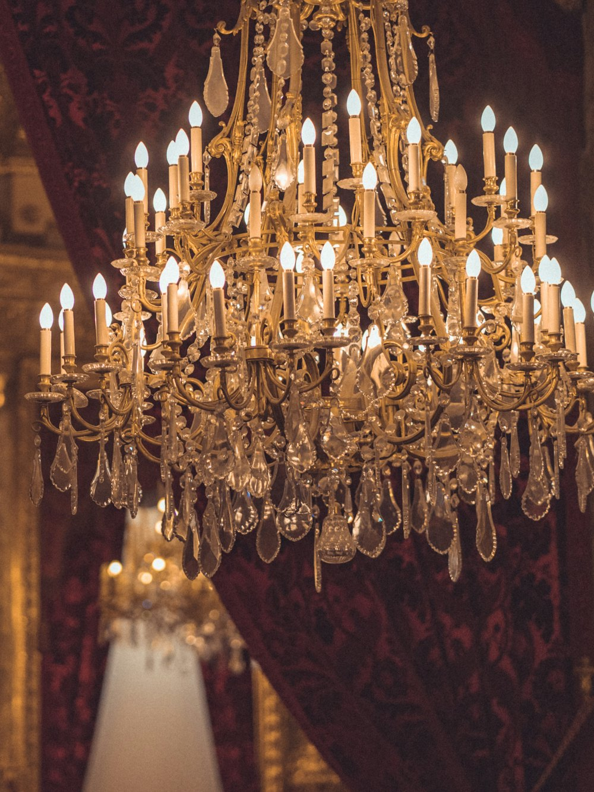

# What to send, and where it goes

Everything below is a placeholder in the live page. Nothing needs a build step —
edit the file, save, refresh.

## 1. Logo

Put the file at `assets/img/logo.svg` (SVG preferred, or a PNG at 2× height).
Then in `index.html`, replace the marked `<svg class="brand__mark">` block in the
header with:

```html

```

There is a second copy of the mark in the footer — replace it the same way.

## 2. Shop name

If the trading name is not exactly "Elegatra", search `index.html` for
`brand__name` (2 places), the `<title>`, and the footer copyright line.

## 3. Photographs — 6 fixtures

Drop the images into `assets/img/`. Each card in the Collection section has a
placeholder marked with `data-slot="…"` naming the filename it expects:

| Card | File |
| --- | --- |
| Sévigné Crystal | `assets/img/sevigne.jpg` |
| Halle Brass Tier | `assets/img/halle.jpg` |
| Murano Bloom | `assets/img/murano.jpg` |
| Ledger Linear | `assets/img/ledger.jpg` |
| Court Banquet | `assets/img/court.jpg` |
| Ora Halo | `assets/img/ora.jpg` |

Replace each placeholder `<div>` with an ``:

```html

```

Shoot or crop them **portrait, 3:4** (e.g. 1200 × 1600). Dark room, fixture lit —
they will sit on a near-black page.

The six names, descriptions and specs are placeholder copy written to show the
layout. Swap them for the real fixtures he stocks.

## 4. Contact details

All in one block in `index.html` — search for `<!-- CONTACT DETAILS`. Replace the
values in square brackets:

- Showroom address
- Phone — update **both** the visible text and the `href="tel:+91…"`
- WhatsApp — update the text and the `href="https://wa.me/91…"` (number only, no
  `+`, no spaces)
- Email — text and `href="mailto:…"`
- Instagram — handle and the profile URL
- Opening hours

## 5. Map

Google Maps → find the shop → Share → **Embed a map** → copy the `<iframe>`.
Paste it in place of the `<div class="mapslot">` block. It is already styled to
match the dark page.

## 6. Optional

- **Favicon**: add `assets/img/favicon.png` and a `<link rel="icon">` in `<head>`.
- **Social preview**: add `og:image` meta tags once there is a hero photograph.
